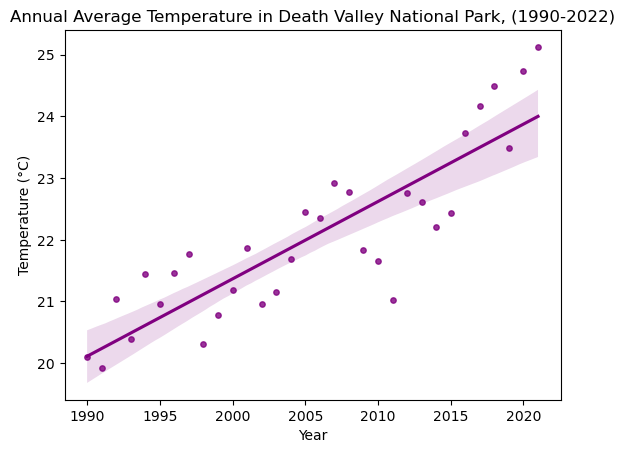
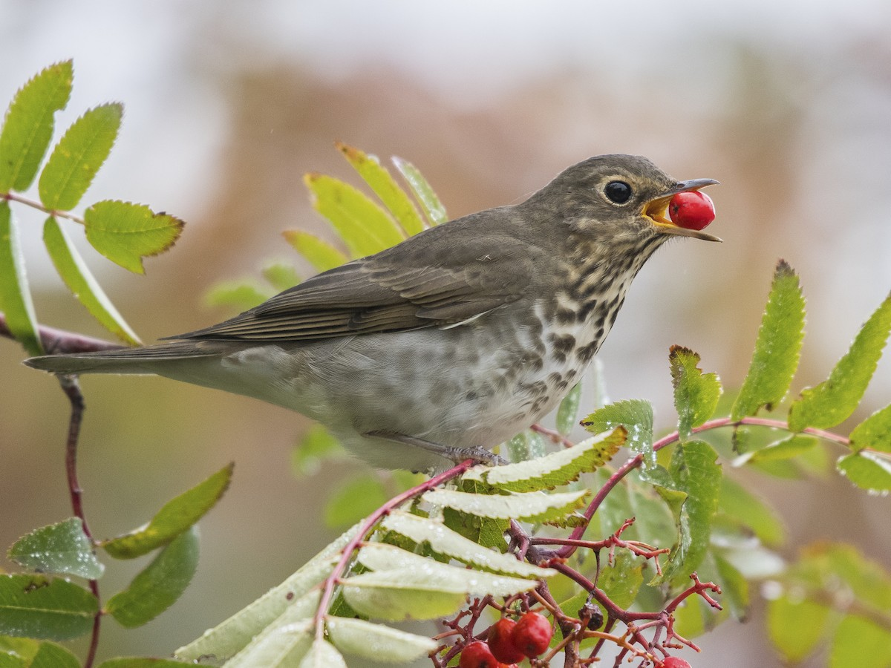
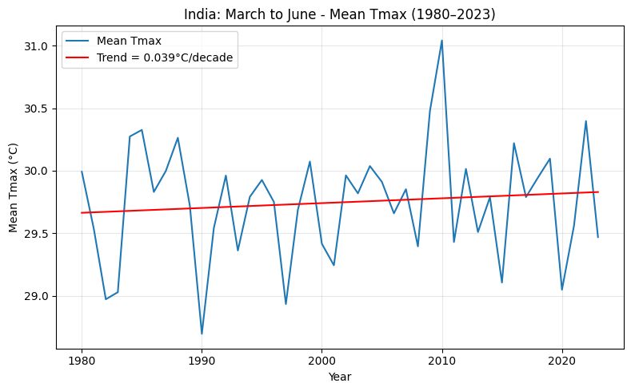
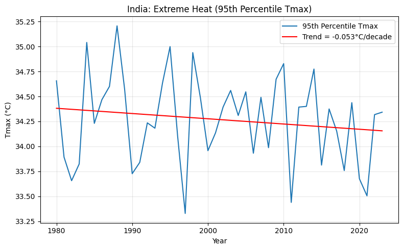
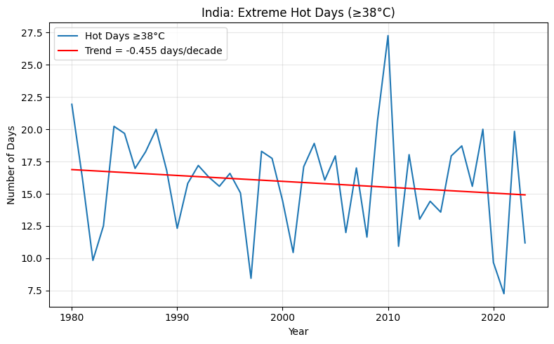
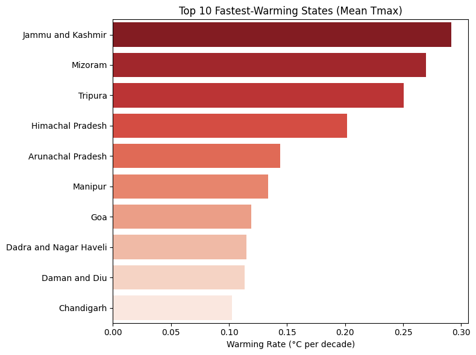

<link rel="stylesheet" href="/assets/css/custom.css?v=3"> 

# **About Me**

Hello! My name is Nisha. If you just stumbled across this, here’s a little bit about me:

I’m a 3rd year PhD student in [Environmental Studies](https://www.colorado.edu/envs/) at the University of Colorado Boulder. I also hold a Masters degree in [Economic Development](https://www.lusem.lu.se/study/masters-programmes/global-development-population-and-economic-change-masters-programme) from Lund University, Sweden and a Bachelors (Research) in [Economics](https://snu.edu.in/programs/bsc-research-in-economics/) from India. 

As part of my PhD, I work on something that touches everyone: **Food**. Specifically,I study how climate change and policy decisions ripple through global food systems — from government trade interventions to the everyday choices of farmers. My work spans three themes: the role of trade policy during climate shocks, how path-dependent institutions lock in agricultural practices, and how farmers adapt on the ground. Put together, I intend to explore how we can make our food systems resilient and what holds them back.  

# **Publications**

## **Academic Papers**

**Geospatial assessment of flood-tolerant rice varieties to guide climate adaptation strategies in India** *N. Koppa, G. Amarnath* *Climate*, 9(10), 151 (2021). [Link](https://doi.org/10.3390/cli9100151)  

**Statistical downscaling differences strongly alter projected climate damages** *S. Miller, N. Ormaza-Zulueta, N. Koppa, A. Dancer*  *Communications Earth & Environment*, 6(1), 145 (2025). [Link](https://doi.org/10.1038/s43247-025-01145-7)  

**Review of Existing Platforms, Gaps and Challenges in CIS delivery in Zambia** *G. Amarnath, N. Alahacon, N. Koppa, T. Sharma, N. Ngowenani, …*  *Accelerating Impacts of CGIAR Climate Research for Africa* (2022). [Link](https://www.climate.cgiar.org/)  

## **Earth Data Science Projects** 

#### **1. Map of CU Boulder** 

<embed type="text/html" src="assets/img/CU.html" width="400" height="400">

#### **2. Warming in Death Valley National Park (1990–2024)**

Death Valley National Park in eastern California is famous for record heat, extreme aridity, and below-sea-level basins. Stark landscapes—salt flats, dunes, badlands, and spring-fed oases—host desert-adapted species living near thermal limits. That makes the park a clear setting to examine recent warming. As seen from the fugure above, from 1990 to 2024, annual average temperature in Death Valley rose by **~0.125 °C per year** (**~1.25 °C per decade**). Most of the warmest years occur after 2015. A simple OLS fit explains **~75%** of year-to-year variation, indicating a strong upward trend. [<a href="{{ '/assets/img/climate-coding-portfolio-assignment-2.html' | relative_url }}"
   target="_blank" rel="noopener">View full workflow</a>]

#### **3. Species Migration**

#### **Exploring Swainsons Thrush (Catharus ustulatus) Migration in the 2023 using Global Biodiversity Information Facility (GBIF)**

Swainson’s Thrush (Catharus ustulatus) — Photo credit: [Birds of the World](https://birdsoftheworld.org/bow/species/swathr/cur/introduction)

**Background**

Swainson’s Thrush (scientific name Catharus ustulatus), is a small to medium-sized **migratory songbird** in the thrush family (Turdidae). It is known for its olive-brown back, buff-colored underparts, a distinct pale eye-ring, and a slightly spotted breast. The species is distributed widely across northern North America for breeding, and winters in Central and South America. ([Audubon.org](https://www.audubon.org/field-guide/bird/swainsons-thrush))

As a classic Nearctic–Neotropical migrant, Swainson’s Thrush travels thousands of kilometers each year. Spring migration typically occurs from mid-March to early June, while fall migration spans late July to early November. Inland birds tend to follow interior routes through the central U.S. into Central America, whereas coastal populations use a more Pacific flyway. These birds rely on forested stopover habitats along their route for rest and refueling, making them particularly sensitive to habitat changes across a vast geographic range ([E-bird Status and Trends](https://science.ebird.org/en/status-and-trends/species/swathr/range-map))

Although Swainson's Thrush is still considered one of the most common birds of northern spruce-fir forests, populations are declining even where abundant, particularly in Alaska and the Northeast ([Mack and Yong, 2020](https://birdsoftheworld.org/bow/species/swathr/1.0/introduction?printable)). While the reasons are not known yet, the Swainson’s Thrush faces growing threats from habitat loss, window strikes during nocturnal flights, and potential climate-related shifts in food availability. As different populations use distinct migration corridors, conservation strategies must account for their migratory connectivity — protecting not just breeding grounds, but also critical stopover and wintering habitats.([Humpel et al., (2020)](https://www.nature.com/articles/s41598-020-62132-6))

**Data and Methods**

*Data*

For this analysis, I use the species observation data from the Global Biodiversity Information Facility (GBIF). The Global Biodiversity Information Facility (GBIF) is a free, global database that brings together information about where and when different species have been observed. These records come from many sources—like research projects, birdwatching apps, museum collections, and citizen science initiatives. Each record usually includes the species name, the exact location (with coordinates), the date of the observation, and who collected the data. Because the data are standardized and easy to access, GBIF is widely used to study species distributions, biodiversity patterns, and migration routes. This data was directly downloaded to my computer using the pybif package from python (note: I used the already provided notebook to get this data). 

*Method*

For this small project, I used bird observation data for Swainson’s Thrush from the GBIF website, which included the locations and months when each bird was seen. I turned this data into a geospatial data frame so I could work with the coordinates. I also loaded a map of North American ecoregions (this was downloaded using the sample notebook provided) and made the shapes simpler so the map would plot faster. Using a spatial join, I matched each bird sighting to the ecoregion where it happened. Then, I grouped the data by ecoregion and month to count how many birds were seen in each place and time. To make the results fair, I normalized the counts to account for differences in region size and how often people reported sightings. Finally, I created an interactive map that lets you explore where Swainson’s Thrushes were found throughout the year, showing their migration routes and important habitats. For this analysis, I used the python software, and employed several packages like os, pathlib, calendar, zipfile, getpass, glob, geopandas, pandas, hvplot.pandas, cartopy.crs, and panel. 

Please find my full code for this analysis [here](https://github.com/earthlab-education/02-migration-nkoppa/blob/main/notebooks/Swainsons_portfolio.ipynb)

**Map and Plot**

Each year, *Swainson’s Thrush* (*Catharus ustulatus*) undertakes an extraordinary migratory journey, traveling thousands of kilometers from its **northern breeding grounds** in Canada and the United States to their  **wintering habitats** in Central and South America (Mack and Yong, 2020). In 2023, Swainson’s Thrush migration data reveal a dominant inland flyway stretching from Central America through the central U.S. to Canada. Most observations are clustered along this interior corridor, particularly in mid-latitude regions during April and May, reflecting critical stopover activity during spring migration. The coastal Pacific route appears less densely represented, suggesting that inland migration was more heavily documented or used in 2023. The map also makes visible the transboundary nature of this movement—linking multiple countries across the Americas and underscoring how conserving this species requires cooperation beyond national borders. These migration paths shown on the map highlight how this movement depends on a chain of **interior and coastal flyways**, with birds stopping at key forested habitat. These **stopover sites** are essential links that enable the species to complete its migration successfully (Humpel et al. 2020; USGS 2004).

As noted earlier, while these small birds appear to be common, they appear to be declining in numbers. And as this migration crosses multiple countries, **no single nation can ensure the species’ survival alone**. Habitat loss along the route—from deforestation, urban expansion, or climate-driven shifts—can break this delicate chain of connectivity (Audubon 2025). These disruptions increase the vulnerability of migratory birds that rely on predictable landscapes and timing. Platforms like eBird have made these movements visible through aggregated citizen science data, enabling conservation scientists to monitor changes in distribution and timing at unprecedented scales (eBird 2025).

Ultimately, *Swainson’s Thrush* migration illustrates a broader story: **long-distance migration is a shared ecological responsibility**. Protecting this species requires not just conserving breeding and wintering grounds, but also safeguarding the **habitats in between**, which sustain the journey itself.

The interactive migration map below shows Swainson’s Thrush movement patterns across North America. You can zoom, pan, and interact with the data directly below:

<iframe src="assets/img/Swainsons_Thrush_Migration_2023.html" width="100%" height="600px"></iframe>

*References*

1. Audubon. 2025. “Swainson’s Thrush – *Catharus ustulatus*.” *Audubon Field Guide*. National Audubon Society.  
[https://www.audubon.org/field-guide/bird/swainsons-thrush](https://www.audubon.org/field-guide/bird/swainsons-thrush)
2. Mack, D. E. and W. Yong (2020). Swainson's Thrush (Catharus ustulatus), version 1.0. In Birds of the World (A. F. Poole and F. B. Gill, Editors). Cornell Lab of Ornithology, Ithaca, NY, USA. https://doi.org/10.2173/bow.swathr.01
3. Humpel, M., P. D. Taylor, I. Maggini, and D. R. Norris. 2020. “Migratory Connectivity and Conservation of Swainson’s Thrush (*Catharus ustulatus*) Using Automated Radio Telemetry.” *Scientific Reports* 10: 6364.  
[https://www.nature.com/articles/s41598-020-62132-6](https://www.nature.com/articles/s41598-020-62132-6)
4. Mack, D. E., and W. Yong. 2020. “Swainson's Thrush (*Catharus ustulatus*), Version 1.0.” In *Birds of the World*, edited by A. F. Poole. Cornell Lab of Ornithology.  
[https://doi.org/10.2173/bow.swathr.01](https://doi.org/10.2173/bow.swathr.01)
6. U.S. Geological Survey. 2004. “Stopover Ecology of Western Avian Populations.” *USGS Fact Sheet 2004–3090*.  
[https://pubs.usgs.gov/fs/2004/3090/](https://pubs.usgs.gov/fs/2004/3090/)
7. GBIF.org. (21 October 2025.) GBIF Occurrence Download. [https://doi.org/10.15468/dl.c96k9k](https://doi.org/10.15468/dl.c96k9k)

#### **4. Final Project**

Title: 

**Introduction**

Heat is often called an invisible disaster as it does not leave behind physical destruction. Around the world, major heat events—from Europe in 2003 to Russia in 2010—have caused widespread health crises, power shortages, wildfires, and agricultural losses. Scientific assessments consistently show that heatwaves are becoming more frequent and more intense as the climate warms, posing growing risks for both ecosystems and societies.

India is widely considered as one of the world’s most vulnerable countries to extreme heat. Major heatwaves in 1998, 2010, and 2015 resulted in thousands of recorded deaths (Azhar et al., 2014; Pattanaik et al., 2017). And importantly, many of the country’s hottest months occur before the summer monsoon arrives, creating conditions that can be dangerous for outdoor workers, vulnerable populations, and agricultural operations. These events have prompted growing concern that climate change may be reshaping not only how hot India becomes, but also when dangerous heat arrives and how it varies across regions.

Given the diversity of climates across India—from Himalayan states to coastal regions to densely populated plains—it is valuable to understand how heat conditions are evolving at a regional scale, not just nationally. This project uses more than forty years of ERA5-Land reanalysis data to characterize pre-monsoon or summer heat across Indian states and to examine long-term changes in intensity, extremes, and seasonal timing. Rather than focusing on formal heatwave classification systems, the analysis highlights simple and intuitive indicators such as maximum temperature, extreme hot days, and the first occurrence of severe heat each year.

**Data and Methods**

The analysis is based on hourly 2-meter air temperature from the ERA5-Land reanalysis dataset, which provides spatially continuous temperature estimates at approximately 0.1° resolution. Using the Copernicus Data Store API, I downloaded hourly temperature fields for March through June for each year from 1980 to 2023. This period captures India’s pre-monsoon season, when heat episodes tend to peak. 

After downloading, temperature values were converted from Kelvin to degrees Celsius. I then aggregated the hourly data into daily maximum temperature (Tmax), which provides a widely used indicator of heat stress.

To summarize temperature patterns by state, I used a shapefile of India’s state boundaries and the Python library regionmask to assign each ERA5-Land grid cell to a state. For each state and each year, I averaged the daily Tmax values across all grid cells within its borders.
With these daily state-level temperatures, I computed four main indicators:
     1. Mean Tmax during March–June, which gives a sense of overall heat intensity.
     2. The 95th percentile of Tmax, which captures more extreme heat.
     3. The number of days with Tmax ≥ 38°C.

Note that I chose 38°C because temperatures in the 37–40°C range are commonly used to indicate dangerous heat stress in India, particularly for outdoor work and health impacts (Mazdiyasni & AghaKouchak, 2017; Rohini et al., 2019). This makes it a simple but meaningful threshold for extreme hot days.
     4. The day of the year when Tmax first exceeds 38°C, which provides a rough sense of when severe heat begins in each state.
     
To understand long-term changes, I estimated linear trends in each metric for every state using ordinary least squares. All data processing and analysis were done using Python tools such as xarray, pandas, geopandas, regionmask, matplotlib, and hvplot, allowing for a fully reproducible workflow.

**Results**

To understand how heat has changed across India over the past forty-four years, I began by looking at the national averages of pre-monsoon temperature. When all states are combined, the long-term picture appears surprisingly stable. The mean daily maximum temperature from March through June increases only slightly—about four hundredths of a degree per decade—which is almost flat over the whole period. Even the more extreme end of the temperature distribution, captured by the 95th percentile of daily Tmax, shows a very mild declining trend. A similar pattern emerges for extremely hot days (defined as days above 38°C): on average, India as a whole actually sees a small decrease over time.

At first glance, these results suggest that pre-monsoon heat in India has not changed much. But national averages can easily hide important differences, and that is exactly what happens here. Once the data are broken down state by state, a much more nuanced picture emerges.

### Figure 1. National Mean Tmax Trend (1980–2023)

  

### Figure 2. National 95th Percentile Tmax Trend

  

### Figure 3. Hot Days (≥38°C) Across India

  

Some states show very clear warming signals. The most striking increases occur in Jammu & Kashmir, Mizoram, and Tripura, all of which experience warming between 0.25°C and 0.30°C per decade—several times higher than the national average. These trends are strong enough that they show up clearly despite the natural variability in year-to-year temperatures. They also highlight that the fastest warming in India is not occurring in the traditionally hottest regions, but rather in some of the cooler, high-elevation, or northeastern states.

Figure 4. Top 10 Fastest-Warming States (Mean Tmax Trend per Decade)

  

A different perspective emerges when focusing not on average temperatures but on the occurrence of extreme heat. While India as a whole shows a slight decrease in the number of very hot days (≥38°C), several western states move in the opposite direction. Gujarat, Dadra & Nagar Haveli, and Daman & Diu all show consistent increases in the frequency of days that cross the 38°C threshold. This suggests that even in places where average warming is modest, extremely hot days may still be becoming more common. For regions that already struggle with heat stress, this shift can have significant implications for health, labor productivity, and energy demand.

[Insert Figure 5 — hottest day increases]

Finally, I examined whether extreme heat is occurring earlier in the year. Here, too, the patterns are uneven but meaningful. States such as Haryana and Rajasthan now tend to reach 38°C earlier in the spring than they did in 1980. The change is small—on the order of two to three days per decade—but over a long period, this results in substantially earlier onset of dangerous heat. This matters for agriculture, where crops and irrigation schedules are tied to seasonal timing, and for public health, since communities often prepare for heat later in the season.
[Insert Figure 6 — onset timing shifts]

Taken together, these results show that India’s pre-monsoon heat is not a single story. Nationally, temperatures appear stable, but regional patterns reveal diverse and sometimes opposing trends. Certain states are warming quickly, others are facing more frequent extreme heat, and still others are seeing heat arrive earlier each year. This diversity underscores the importance of studying heat at a local scale, especially in a country as geographically varied as India.

**Conclusion**

# **Contact Information**
[Email](mailto:nisha.koppa@colorado.edu) . [Linkedin](https://www.linkedin.com/in/nisha-koppa-44a642120/) . [Github](https://github.com/nkoppa) 
